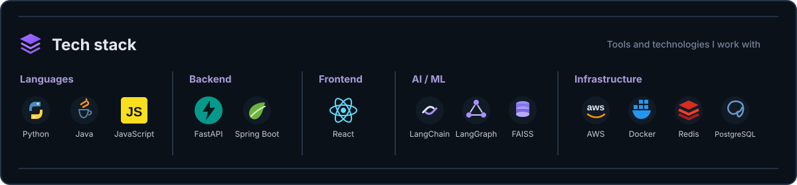
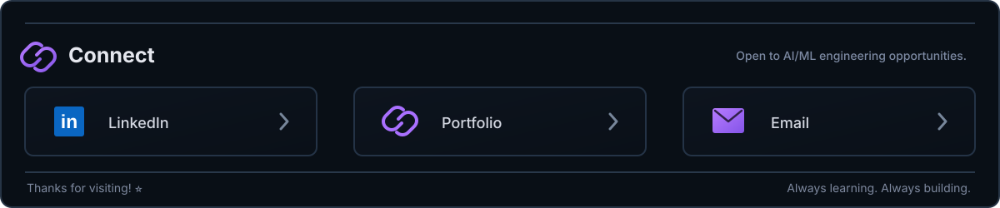

<!-- Banner Section -->

  

<!-- Introduction Section -->
 

  

<!-- GitHub Activity -->

<table width="100%">
  <tr>
    <td colspan="3">
      <h3>📊 GitHub activity</h3>
      Live stats from my GitHub profile
    </td>
  </tr>

  <tr>
    <td width="33%" align="center">
      
    </td>
    <td width="33%" align="center">
      
    </td>
    <td width="33%" align="center">
      
    </td>
  </tr>
</table>

 

<!-- Contribution Heatmap -->

  

  

  

Links of tools used :

1. [⌨️ Readme Typing SVG](https://readme-typing-svg.herokuapp.com/demo/?weight=900&lines=How+vexingly+quick+daft+zebras+jump)
2. 

