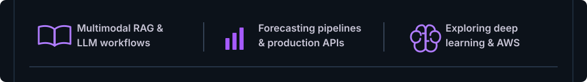

<!-- Banner Section -->

  

<!-- Introduction Section -->
 

  

Links of tools used :

1. [⌨️ Readme Typing SVG](https://readme-typing-svg.herokuapp.com/demo/?weight=900&lines=How+vexingly+quick+daft+zebras+jump)
2. 

